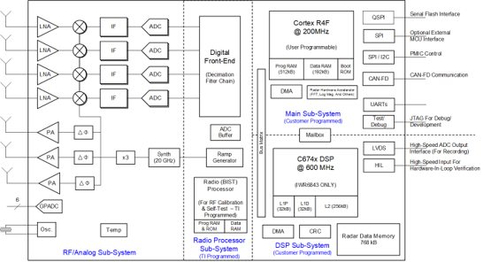
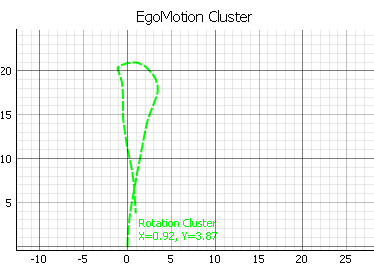

# ResearchProject

This repository captures the full lifecycle of the project—from the early planning notes and 3D models through the embedded code that runs on the Raspberry Pi 5, supporting presentations, and the final written report. Use the structure below to understand where each asset lives and how the core software pieces fit together.

## Repository Structure

- [01_Planning](01_Planning/): Project planning artefacts, schedules, and research that guided the implementation roadmap.
- [02_Models](02_Models/): 3D models and CAD resources created for the hardware layout.
- [03_Code](03_Code/): Source code for experiments, embedded services, and visualization tools.
  - [01_Python](03_Code/01_Python/): Prototype scripts and data-processing experiments used during development.
    - [06_sensorFusion](03_Code/01_Python/06_sensorFusion/): Focused notebooks and scripts for validating sensor fusion logic prior to deployment.
      - [03_Code-qtViewLogs](03_Code/01_Python/06_sensorFusion/03_Code-qtViewLogs/): Qt-based views for replaying and inspecting recorded sensor logs.
      - [03_Code-liveViewLogs](03_Code/01_Python/06_sensorFusion/03_Code-liveViewLogs/): Utilities for streaming fused data live during test sessions.
  - [02_C++](03_Code/02_C++/): Production modules compiled for the Raspberry Pi 5, organized by sensor subsystem.
    - [01_mmWave-IWR6843](03_Code/02_C++/01_mmWave-IWR6843/): Interfaces with the mmWave radar to capture and stream radar data.
    - [02_MTi-G-710](03_Code/02_C++/02_MTi-G-710/): Handles IMU data acquisition and synchronization.
    - [03_sensorFusion](03_Code/02_C++/03_sensorFusion/): Combines individual sensor feeds into a unified view used in the live system.
    - [04_C270HD](03_Code/02_C++/04_C270HD/): Manages the Logitech C270 HD camera for visual context.
  - [03_QTFramework](03_Code/03_QTFramework/): Desktop tools built with Qt for reviewing data and monitoring system health.
    - [01_pointCloudVisualizer](03_Code/03_QTFramework/01_pointCloudVisualizer/): Main GUI for log visualization, aligning radar and fusion outputs with captured footage.
  - [04_C#](03_Code/04_C#/): Legacy utilities retained for reference.
- [04_Logs](04_Logs/): Raw recordings and datasets captured during testing and validation.
  - [01_sensorFusion](04_Logs/01_sensorFusion/): Multi-sensor captures aligned for fusion analysis.
  - [02_IWR6843-standAlone](04_Logs/02_IWR6843-standAlone/): Radar-only sessions for algorithm calibration.
  - [03_mti-standAlone](04_Logs/03_mti-standAlone/): IMU-focused recordings for sensor characterization.
- [05_test](05_test/): Sandbox area for temporary experiments and files that are safe to remove.
- [06_PresentationUpdates](06_PresentationUpdates/): Iterative presentation decks documenting project progress and milestones.
- [07_Literature](07_Literature/): Research papers, notes, and references that informed the system design.
- [08_Documentation](08_Documentation/): Final report and supplementary documentation describing the full project.
  - [images](08_Documentation/images/): Reference figures illustrating the hardware layout, calibration process, and data products described in the report (see previews below).

## Visual Highlights

To complement the directory overview, the following snapshots provide quick visual context for the system:

*System block diagram outlining how radar, IMU, and vision data flow through the fusion pipeline.*

*Vehicle mounting layout depicting where each sensor is installed for data collection.*

*Representative fused point cloud log that can be replayed with the Qt visualization utilities.*

## How to Navigate the Code

1. **Review Python prototypes** in `03_Code/01_Python`, with special attention to `06_sensorFusion`, to understand how sensor data was processed during early experimentation.
2. **Examine the Raspberry Pi services** in `03_Code/02_C++`, where each sensor has a dedicated module for acquisition and fusion.
3. **Open the Qt visualization tools** in `03_Code/03_QTFramework`—particularly `01_pointCloudVisualizer` and the Python-based `03_Code-qtViewLogs` utilities—to replay and inspect logs from `04_Logs`.
4. **Reference documentation and presentations** in `06_PresentationUpdates` and `08_Documentation` for context when presenting or extending the system.

