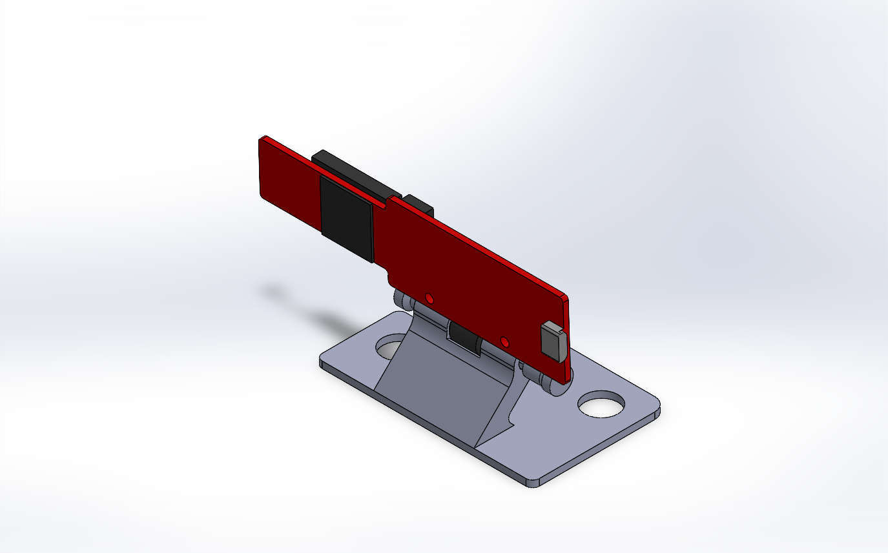
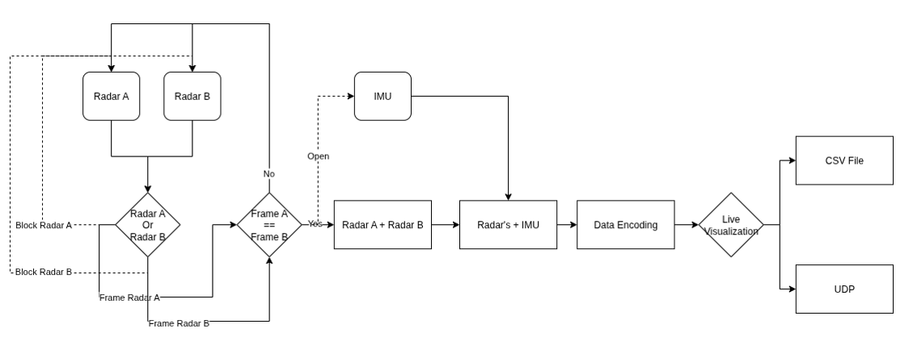

# ResearchProject

This repository captures the full lifecycle of the project—from the early planning notes and 3D models through the embedded code that runs on the Raspberry Pi 5, supporting presentations, and the final written report. Use the structure below to understand where each asset lives and how the core software pieces fit together.

## Repository Structure

- [01_Planning](01_Planning/): Project planning artefacts, schedules, and research that guided the implementation roadmap.
- [02_Models](02_Models/): 3D models and CAD resources created for the hardware layout (summarized in [02_Models/README.md](02_Models/README.md)).
- [03_Code](03_Code/): Source code for experiments, embedded services, and visualization tools.
  - [01_Python](03_Code/01_Python/): Prototype scripts and data-processing experiments used during development—the final visualization dashboards also live here.
    - [06_sensorFusion](03_Code/01_Python/06_sensorFusion/): Focused notebooks and scripts for validating sensor fusion logic prior to deployment.
      - [03_Code-qtViewLogs](03_Code/01_Python/06_sensorFusion/03_Code-qtViewLogs/): Final Qt-based views for replaying and inspecting recorded sensor logs (see the [labDriveAroundICP_Full1 visualization](08_Documentation/images/labDriveAroundICP_Full1.png)).
      - [03_Code-liveViewLogs](03_Code/01_Python/06_sensorFusion/03_Code-liveViewLogs/): Utilities for streaming fused data live during test sessions.
  - [02_C++](03_Code/02_C++/): Production modules compiled for the Raspberry Pi 5, organized by sensor subsystem; these services handle the on-vehicle data acquisition that feeds the shared logs.
    - [01_mmWave-IWR6843](03_Code/02_C++/01_mmWave-IWR6843/): Interfaces with the mmWave radar to capture and stream radar data.
    - [02_MTi-G-710](03_Code/02_C++/02_MTi-G-710/): Handles IMU data acquisition and synchronization.
    - [03_sensorFusion](03_Code/02_C++/03_sensorFusion/): Combines individual sensor feeds into a unified view used in the live system.
    - [04_C270HD](03_Code/02_C++/04_C270HD/): Manages the Logitech C270 HD camera for visual context.
  - [03_QTFramework](03_Code/03_QTFramework/): Early Qt experiments retained for reference (they are not part of the final toolchain).
    - [01_pointCloudVisualizer](03_Code/03_QTFramework/01_pointCloudVisualizer/): Prototype GUI for log visualization; compare it against the polished Python `03_Code-qtViewLogs` utilities above.
  - [04_C#](03_Code/04_C#/): Legacy utilities retained for reference.
- [04_Logs](04_Logs/): Raw recordings and datasets captured during testing and validation (see the dedicated [folder README](04_Logs/README.md) for naming conventions).
  - [01_sensorFusion](04_Logs/01_sensorFusion/): Multi-sensor captures aligned for fusion analysis.
  - [02_IWR6843-standAlone](04_Logs/02_IWR6843-standAlone/): Radar-only sessions for algorithm calibration.
  - [03_mti-standAlone](04_Logs/03_mti-standAlone/): IMU-focused recordings for sensor characterization.
- [05_test](05_test/): Sandbox area for temporary experiments and files that are safe to remove.
- [06_PresentationUpdates](06_PresentationUpdates/): Iterative presentation decks documenting project progress and milestones.
- [07_Literature](07_Literature/): Research papers, notes, and references that informed the system design.
- [08_Documentation](08_Documentation/): Final report and supplementary documentation describing the full project (start with the concise [folder README](08_Documentation/README.md)).
  - [ProjectNavigationGuide.md](08_Documentation/ProjectNavigationGuide.md): A narrative overview of the project goals, sensing hardware, and directory structure to help new contributors ramp up quickly.
  - [images](08_Documentation/images/): Reference figures illustrating the hardware layout, calibration process, and data products described in the report (see previews below).

## Visual Highlights

To complement the directory overview, the following snapshots provide quick visual context for the system. Each image is stored
under `09_Images/` so you can swap in updated artwork at any time (see [`09_Images/README.md`](09_Images/README.md) for replacement tips):

*Project integration summary showing how the dual radars, IMU, and optional camera feed into merge, fusion, and odometry services.*

*Sensor highlights on the platform, reinforcing where the IMU, dual mmWave units, and optional camera reside.*

*3D model references that detail the mechanical mounts for the radar and IMU assemblies.*

*High-level view of the C++ implementation flow—from raw sensor frames and fusion through encoding, visualization, and logging.*

## How to Navigate the Code

1. **Review Python prototypes** in `03_Code/01_Python`, with special attention to `06_sensorFusion`, to understand how sensor data was processed during early experimentation.
2. **Examine the Raspberry Pi services** in `03_Code/02_C++`, where each sensor has a dedicated module for acquisition and fusion.
3. **Open the visualization tools** in `03_Code/01_Python/06_sensorFusion/03_Code-qtViewLogs` to review the polished Qt dashboards (compare against the archived `03_Code/03_QTFramework` experiments if you need the older prototypes). Pair them with `04_Logs` captures for context.
4. **Reference documentation and presentations** in `06_PresentationUpdates` and `08_Documentation` for context when presenting or extending the system.

