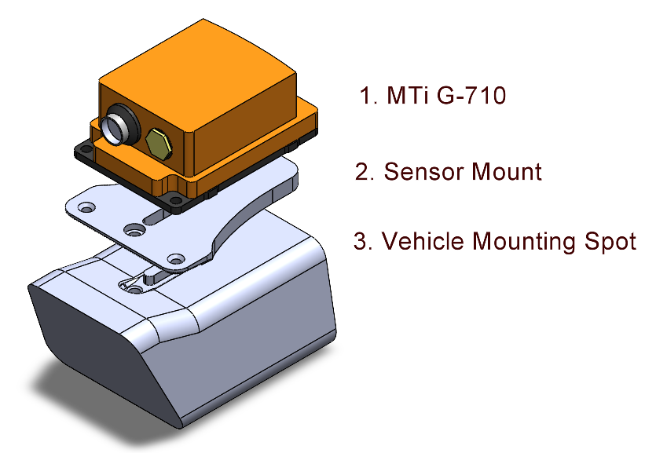

# ResearchProject

This repository documents the complete development pipeline—from early planning and CAD work to embedded software, visualizations, presentations, and the final report. The structure is designed to help new contributors quickly understand where each component lives and how the system fits together.

## Repository Structure

### 01_Planning
Project schedules, research notes, and early design materials that shaped the implementation roadmap.

### 02_Models
3D and CAD assets for the hardware layout. A summary is available in `02_Models/README.md`.

### 03_Code
All experimental and production software.

- **01_Python**  
  Prototypes, data-processing experiments, and the final visualization tools.  
  - **06_sensorFusion**  
    Notebooks and scripts used to validate fusion logic.  
    - **03_Code-qtViewLogs**  
      Final Qt-based log-replay and inspection tools (example: `labDriveAroundICP_Full1.png`).  
    - **03_Code-liveViewLogs**  
      Utilities for live streaming fused data during tests.

- **02_C++**  
  Raspberry Pi 5 production modules, organized by sensor subsystem.  
  - **01_mmWave-IWR6843** – Radar data acquisition.  
  - **02_MTi-G-710** – IMU data capture and synchronization.  
  - **03_sensorFusion** – Real-time fusion of all sensor feeds.  
  - **04_C270HD** – Camera acquisition for visual context.

- **03_QTFramework**  
  Early Qt prototypes kept for historical reference.  
  - **01_pointCloudVisualizer** – Initial log-visualization GUI.

- **04_C#**  
  Legacy utilities preserved for completeness.

### 04_Logs
Datasets captured during testing. See `04_Logs/README.md` for naming conventions.  
- **01_sensorFusion** – Multi-sensor aligned logs.  
- **02_IWR6843-standAlone** – Radar-only calibration sessions.  
- **03_mti-standAlone** – IMU-only characterization runs.

### 05_test
Temporary experiments and disposable work.

### 06_PresentationUpdates
Progress presentations and milestone decks.

### 07_Literature
Research papers and notes used throughout system design.

### 08_Documentation
Complete written report and supporting documents.  
- **ProjectNavigationGuide.md** – High-level introduction to project goals, sensing hardware, and directory layout.  
- **images** – Figures used throughout the report.

## Visual Highlights

The images below (stored in `09_Images/`) provide a quick overview of the system. You can replace or update them at any time; see `09_Images/README.md` for details.

  
*System integration overview showing how radar units, IMU, and camera connect to the Raspberry Pi pipeline.*

  
*Annotated platform view identifying all mounted sensors.*

   
*CAD references for the radar/IMU enclosure and IMU mounting bracket.*

  
*High-level view of the processing flow from raw sensor frames to fusion, encoding, visualization, and logging.*

## How to Navigate the Code

1. Start with the Python prototypes in `03_Code/01_Python`, especially the `06_sensorFusion` folder, to see how sensor data was explored and validated before deployment.  
2. Explore the Raspberry Pi services under `03_Code/02_C++` to understand the production system and how each sensor’s data enters the fusion pipeline.  
3. Use the Qt visualization tools in `03_Code/01_Python/06_sensorFusion/03_Code-qtViewLogs` for reviewing logs. For comparison, the early Qt experiments are archived in `03_Code/03_QTFramework`.  
4. Consult `06_PresentationUpdates` and `08_Documentation` for broader system explanations, figures, and presentation-ready material.
